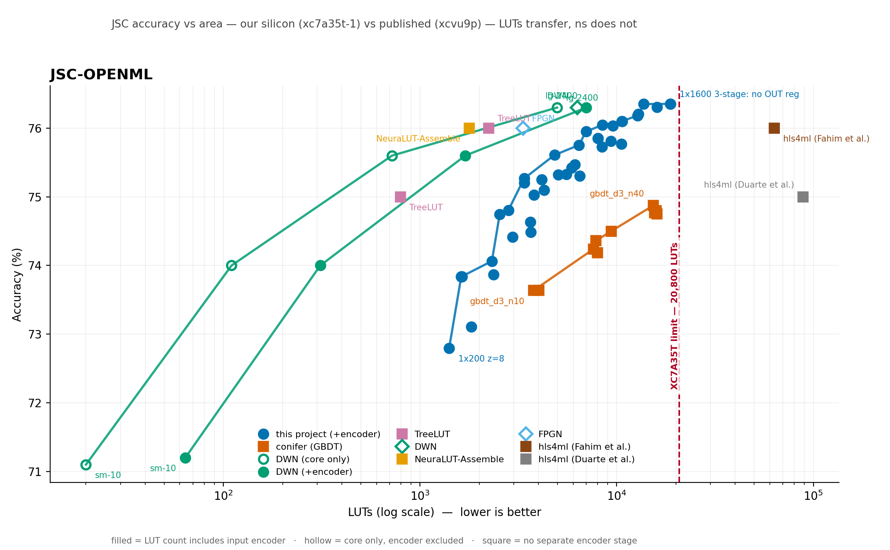

# DWN on FPGA — a neural network with no math in it

**What if a neural network had zero multiplication, zero addition — nothing but memory lookups?**

That's a **Differentiable Weightless Neural Network (DWN)** ([Bacellar et al., ICML 2024](https://arxiv.org/abs/2410.11112)). Instead of the usual
weights-and-arithmetic every neural net uses, a DWN is built entirely out of tiny lookup tables. And
here's the part that makes it worth building in hardware: a lookup table is *also* the basic building
block an FPGA chip is made of. On this design, a "neuron" isn't just similar to a hardware lookup
table — it **is** one, 1-to-1.

The catch: the paper's authors released the training code, but never the hardware. So we're building
it from scratch — hand-writing the actual chip-level circuit (Verilog) and running it on a $150
student FPGA board, far smaller and cheaper than the chips the original paper used.

## What we're doing

1. **Build it.** Take a trained model, hand-write the digital circuit for it, and get it running on a
   physical board — not a simulation.
2. **Map its limits.** Sweep dozens of versions of the network — bigger, smaller, different settings —
   and find exactly how far you can push it before a small, cheap chip runs out of room.
3. **Compare it fairly.** Build the same task with the two standard industry tools for this kind of
   job, on the identical chip, and see how hand-built weightless hardware stacks up.

## Why it's interesting

- No arithmetic circuits at all — just memory, wired up by training instead of by hand.
- Runs in **nanoseconds** — fast enough for real-time particle physics triggers at the Large Hadron
  Collider, which is the actual benchmark task this project uses.
- Nobody has shown this running on hardware students can actually afford.

## Status

✅ **It runs on real hardware**, and we have mapped how far it goes.

| Phase | What | Status |
|---|---|---|
| 1 — Core | Get the model running on the board | ✅ **complete** |
| 2 — Design Space Exploration | Map how big/accurate/fast it can go | ✅ **complete** |
| 3 — Controlled Comparison | Compare against standard tools + published results | ✅ **complete** |
| Stretch — second dataset (MNIST) | Repeat 2 & 3 on a different problem | next |

### Phase 1 — it works on silicon

The reference config is **`1x50`**: 50 lookup-table neurons, the paper's smallest JSC model.

| | |
|---|---|
| Hardware vs software | **166,000 / 166,000** exact |
| Accuracy | 73.84% (the paper's config: 74.0%) |
| The neural network | **108 LUTs** — the paper reports 110 |
| Whole design on the board | 2,058 LUTs (9.9% of the chip), 0 DSPs |
| Speed | 4 clock cycles, one result every clock — 99.5 M classifications/s |

### Phase 2 — how far it goes

**52 configurations**, every one verified bit-exact against the software model and
placed-and-routed on the real part.

| | |
|---|---|
| **Largest model that fits** | **`1x2400`** — 76.18%, 12,751 LUTs (**61%** of the chip) |
| **Best accuracy that fits** | `1x1600` variant — 76.35% at **66%** of the chip |
| The measured edge | timing, not area: two configs use <81% of the chip yet miss 100 MHz |
| Every config | **0 DSPs, 0 block RAM** |

**Three findings the original paper could not have seen**, because it reports three model sizes
and nothing between them:

1. **The paper's largest model runs on a $150 board.** Its 2400-neuron `lg` config was thought
   not to fit — we projected >100% of the chip ourselves. It uses **61%**, once you stop paying
   for a setting that buys nothing.
2. **The paper's thermometer setting is past its own knee.** It fixes `z=200` everywhere and
   never reports the cost. `z=50` gives up 0.24 points for **40% less silicon**, and `z=400`/`800`
   are *worse* while costing more.
3. **The encoder dominates at small sizes and inverts at large ones** — 14.1× the network at 50
   neurons, 2.8× at 2000. The input encoder is the real cost of a weightless network on a small
   FPGA, and published LUT counts routinely exclude it.
4. **What runs out first is the clock, not the chip.** Every model too big for the board still
   had a third of its area free — it just could not be clocked fast enough.

**Read this next:** [`docs/phase2-report.md`](./docs/phase2-report.md) — the full sweep, all 46
configurations, and the six things that broke along the way.

### Phase 3 — how it compares

Two halves: two competing toolchains — a **gradient-boosted decision tree** through conifer and a
**quantized neural network** through hls4ml — both synthesized on the *same part, same flow, same
clock* as every DWN config; and the published LUT-DNN literature, 32 rows across 11 methods.

**Against a GBDT on identical silicon** — 14 conifer configurations, 10 of which fit:

| | |
|---|---|
| At any area budget | DWN is **+1.5 to +1.7 points** more accurate |
| At matched accuracy | DWN uses **2.3–6.0× fewer LUTs** |
| Can a GBDT catch up? | **No.** It tops out at 74.88% using 74% of the chip; DWN reaches that at 3,381 LUTs |
| Where the GBDT wins | **Speed, clearly** — 477 MHz against our 101, and 4–17 ns against our 27–40 |
| Both | 0 DSPs, 0 block RAM, every configuration |

**Against hls4ml on identical silicon** — 6 configurations, only 1 of which fits. The published
network needs **259,492 LUTs** on a 20,800-LUT chip, and is *still* 2.2× too big after 16× internal
time-sharing. Making it fit takes quarter-width layers, 12-bit numbers and 4× time-sharing:

| at ~8,700 LUTs | hls4ml | DWN |
|---|---|---|
| accuracy | 75.67%\* | **76.05%** |
| DSPs | **53** (of 90 on the chip) | **0** |
| block RAM | 2 | **0** |
| latency | 34 cycles | **4 cycles** |
| throughput | one result every 4 cycles | **one every cycle** |

Smaller, more accurate, no DSPs, and **8.5× lower latency at 4× the throughput**.

\**hls4ml's accuracy here is its full-precision figure — we could not measure the quantized one
without a C++ compiler, so the real number is lower and the comparison already favours it.*

**But the more useful finding is about the literature itself.** Setting up a fair comparison
turned out to be the hard part, because the standard comparison table in this field — the one
reproduced in the DWN paper, in the follow-up work, and in a 2025 survey — is broken in two ways:

1. **"JSC" is two different datasets.** An OpenML version (~830k samples) and a CERNBox version
   (~987k). They are routinely listed in one table, and the same method scores **~1.05 points
   higher** on OpenML — seven times our measurement noise. Half the numbers everyone compares
   against are on the other dataset.
2. **LUT counts mix conventions.** The DWN paper reports its largest model at 4,972 LUTs — the
   network only, no input encoder. With the encoder it is 7,011. Ours are always complete
   designs. Three different published numbers exist for that one model.

Both defects start in the primary sources and spread by copying. Our comparison scripts refuse
to plot two datasets on one axis, or to draw a frontier across two conventions — enforced in
code, not in a footnote.

*One caveat we are still chasing: we have asked the DWN authors which of the two JSC datasets
their published numbers use. Their paper says one thing and their released code says another. It
does not affect the conifer comparison above, but it does affect how our accuracy lines up with
theirs.*

**Where that leaves us, stated plainly:** on our own dataset the best published design reaches
76.0% in **1,780 LUTs** against our 12,751. We are not competitive on raw area with the
specialised LUT-DNN compilers. What is different about ours is that it includes the encoder, and
runs on a **$150 board** rather than a data-centre FPGA.

**Read this next:** [`docs/phase3-report.md`](./docs/phase3-report.md) — the comparison, both
literature defects, and what we chose not to measure.

## Documentation

**Start here:** [**`REPORT.md`**](./REPORT.md) — the full write-up as a standalone document.
Background, method, results, comparison, limitations, appendices and a glossary; readable without
any other file in this repository.

| | |
|---|---|
| [**`REPORT.md`**](./REPORT.md) | **the complete report** — standalone, with appendices and glossary |
| [`docs/phase1-report.md`](./docs/phase1-report.md) | what was built, what broke, how to reproduce it |
| [`docs/phase2-report.md`](./docs/phase2-report.md) | the design-space exploration and its results |
| [`docs/phase3-report.md`](./docs/phase3-report.md) | the controlled comparison, and two defects in the literature's own tables |
| [`docs/results/`](./docs/results/) | every measurement, both figures, the trained grid |
| [`docs/results-cc/`](./docs/results-cc/) | the conifer measurements and the comparison figures |
| [`docs/project-brief.md`](./docs/project-brief.md) | the full technical plan |
| [`docs/phase1-ledger.md`](./docs/phase1-ledger.md) · [`phase2-ledger.md`](./docs/phase2-ledger.md) · [`phase3-ledger.md`](./docs/phase3-ledger.md) | dated working logs |

## Repository

| | |
|---|---|
| [`rtl/example-model-1x50/`](./rtl/example-model-1x50/) | **a real DWN in Verilog, committed to be read** — the config that ran on the board |
| `exporter/` | trained checkpoint → lookup tables, wiring, thresholds |
| `rtlgen/` | that export → Verilog |
| `rtl/` `tb/` | hand-written primitives · golden-model testbench |
| `harness/` | UART, vector store, benchmark FSM — the board design |
| `dse/` | the sweep: grid, runner, area model, report, plots |
| `scripts/` | Gate 1, synthesis, bitstream, board host |
| `experiments/` | analyses outside the shipped flow |

## Built on

This project implements an architecture we did not invent. The DWN model, the training method,
and the idea that one weightless neuron maps to one FPGA lookup table are all from:

> **Differentiable Weightless Neural Networks**
> Bacellar et al., ICML 2024 — [arXiv:2410.11112](https://arxiv.org/abs/2410.11112) ·
> [PMLR v235](https://proceedings.mlr.press/v235/bacellar24a.html)

Training uses the authors' own implementation, [`alanbacellar/DWN`](https://github.com/alanbacellar/DWN),
vendored as a submodule pinned at `9f887a0`. Our exporter reads whatever checkpoint format that
commit produces — see [`docs/checkpoint-format.md`](./docs/checkpoint-format.md).

**What is ours:** the RTL and its generator, the golden-model testbench and bit-exactness harness,
the board design, the design-space exploration, and every measurement reported here. The upstream
repository ships PyTorch training only — no RTL, no HLS, no FPGA flow — which is the gap this
project exists to fill.

The benchmark is **jet substructure classification (JSC)**, the standard low-latency FPGA-ML task,
via the `hls4ml_lhc_jets_hlf` dataset.

## Team

Two undergrads, one shared repo.
