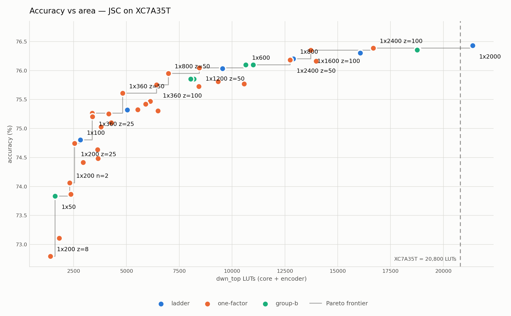
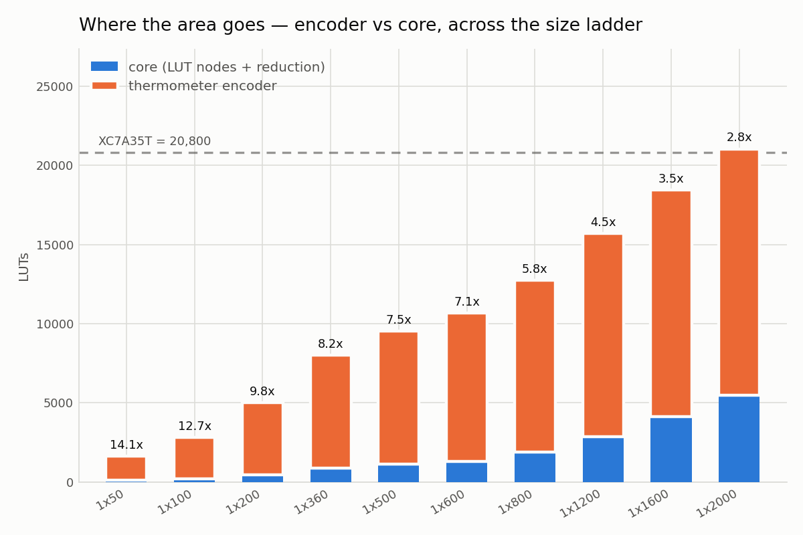
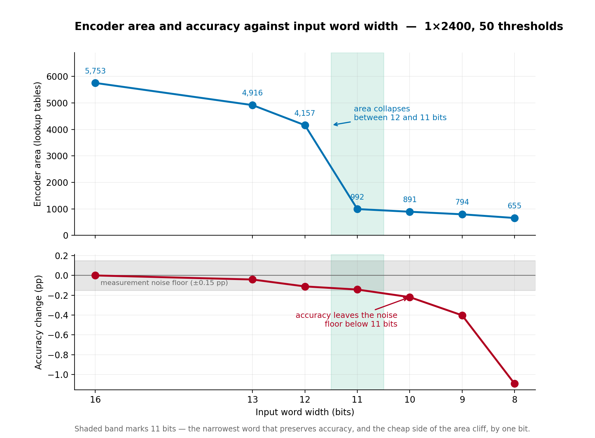
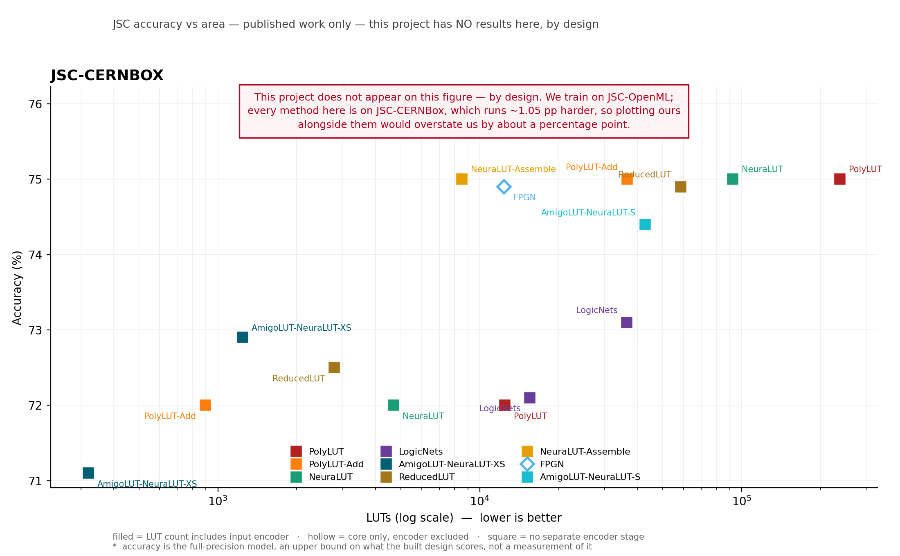
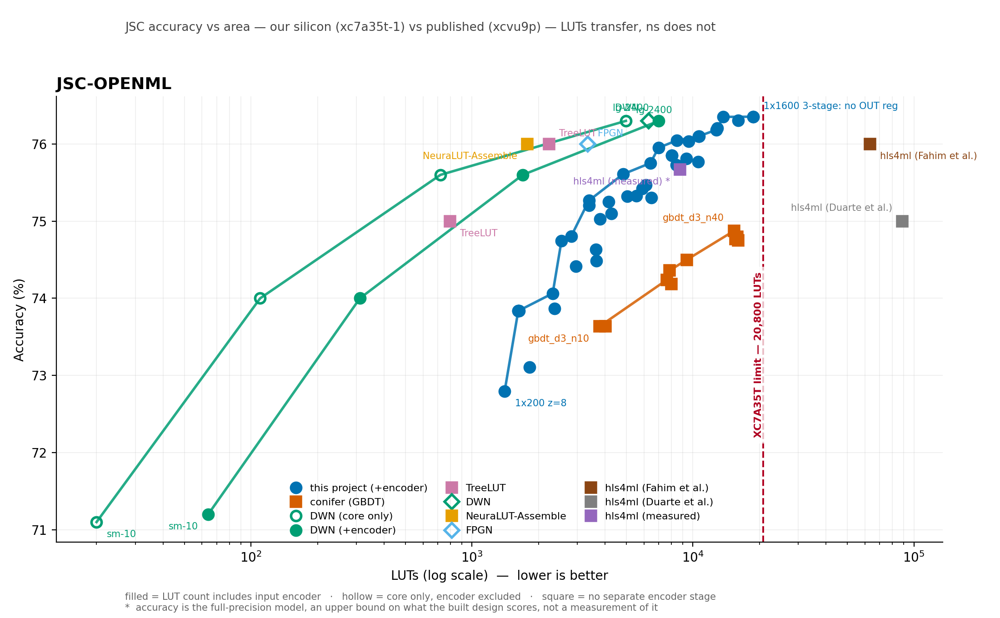

# Weightless Neural Networks on an Entry-Level FPGA: Two Datasets, and Two Defects in How the Field Compares Results

**Kanishk Sama · Krithik Sama**
The University of Texas at Austin

---

> **Scope and versions.** This report covers both datasets. The per-dataset studies have the depth:
> [`docs/jsc/report.md`](./docs/jsc/report.md) and [`docs/mnist/report.md`](./docs/mnist/report.md).
> JSC figures are measured at the tag **`jsc-complete`**, MNIST figures at **`mnist-complete`**;
> later work shifted some JSC areas by ≤0.12%, so the two sets describe different commits. Every
> table below states which dataset it is about, and **no table mixes them**.

## Abstract

A Differentiable Weightless Neural Network (DWN) replaces multiply-accumulate arithmetic with
lookup tables, which map directly onto the lookup tables an FPGA is built from. Published results
target data-centre parts. We implement the architecture in hand-written Verilog and measure it on a
Digilent Basys 3 — a $150 board with a Xilinx Artix-7 XC7A35T, 20,800 lookup tables, roughly one
fifty-seventh the logic of the device the original work used.

We report two datasets. **Jet substructure classification** (16 features, 5 classes) is the
standard low-latency FPGA-ML benchmark; **MNIST** (784 features, 10 classes) is a deliberately
different second target chosen to test whether the generator had been fitted to one problem. In
total **77 configurations** are place-and-routed, every one verified bit-exact against its software
model in simulation, and one configuration per dataset verified bit-exact **on the physical board**
across the whole test set — 166,000 and 10,000 samples respectively.

The second dataset is what makes three findings available. The **encoder-convention defect** —
published lookup-table counts that silently exclude the input encoder — recurs on MNIST and is
*width-dependent* there, so no fixed correction factor repairs a mis-conventioned table. The
**dataset-ambiguity defect** — "JSC" naming two different datasets ~1.05 points apart — turns out
**not** to apply to MNIST, establishing that it is specific to that benchmark rather than endemic.
And **the encoder's share of a design inverts between the two problems**, from 94% of the smallest
JSC design to 21% of the largest MNIST one, which is why a single area model calibrated on one
dataset does not transfer.

We do not claim the architecture is the best available on either dataset. On MNIST, ULEEN — a
weightless network of the same lineage — is more accurate than anything we built. What we show is
that the architecture runs, bit-exactly and at competitive area, on hardware two orders of
magnitude cheaper than the literature assumes.

---

## 1. Background

### 1.1 Lookup tables, in hardware and in the model

The Artix-7 XC7A35T contains 20,800 six-input lookup tables. Each stores 64 bits and, given six
input bits, returns the bit at that address. Everything else on the device — arithmetic, control,
comparison — is built from these.

A weightless neuron with *n* inputs is a table of 2ⁿ learned bits addressed by its inputs. At
*n* = 6 that is exactly the hardware primitive. We measured the correspondence rather than assuming
it: a 50-neuron layer synthesizes to exactly 50 lookup tables, one-to-one.

### 1.2 The architecture, in four stages

**Binarization.** Real-valued features become bits by *thermometer encoding*: each feature is
compared against a series of thresholds, one bit per threshold. We use the distributive variant
[2], where thresholds sit at quantiles of the training distribution rather than at even intervals.

**Lookup layers.** Groups of *n* bits address a table; each table emits one bit; those bits address
the next layer. Which bits feed which table is *learned* during training and then frozen, so the
wiring costs nothing at inference.

**Reduction.** The final layer's bits are split equally among the classes and counted — a
*popcount*.

**Decision.** The highest count wins, resolved by an argmax tree.

No stage multiplies. The network is memory reads, one adder tree, and one comparison tree — which
is why every design here uses **zero DSP blocks and zero block RAM**.

### 1.3 The encoder is hardware, and it is not free

Thermometer encoding is usually described as preprocessing. In a fully parallel FPGA design it is a
comparator per threshold that some neuron actually reads. In the smallest JSC design we measured,
the encoder occupies **1,519 lookup tables against the network's 108** — fourteen times the model
it feeds.

**Published figures for this architecture generally exclude it.** That is the defect §6.1 is about,
and §5.1 shows why a second dataset was needed to understand its size.

### 1.4 How configurations are named

`1x300` is one layer of 300 neurons; `2x[1000,500]` is two layers. `z` is thermometer thresholds
per feature, `n` is inputs per neuron. So `1x1000 z=25` is a single 1,000-neuron layer over an
encoder with 25 thresholds per input feature.

## 2. What was built

The upstream authors released PyTorch training code and no hardware. Everything below the training
step is ours:

```
checkpoint ──► exporter ──► lookup tables, wiring, thresholds
                              │
                              ├──► RTL generator ──► Verilog (core, encoder, top)
                              └──► golden model  ──► test vectors + expected outputs
                                                        │
                                              self-checking testbench
```

A DWN neuron is a 6-input lookup table, which is exactly what an Artix-7 slice provides — measured,
not assumed: 50 neurons synthesize to exactly 50 lookup tables. The rest of a design is the
**thermometer encoder**, which turns real-valued inputs into the bits the tables index, and a
**reduction stage** — per-class popcounts and an argmax tree.

**No design in either study uses a single DSP or block RAM.** The network lives entirely in logic.

Both datasets are produced by the same code. Dataset facts — feature counts, word widths, sweep
axes — live in a descriptor package and nowhere else; the exporter, generator, RTL and testbenches
do not know which problem they are compiling. Reaching that state required removing seven separate
hard-coded assumptions, described in [`docs/mnist/report.md`](./docs/mnist/report.md) §2.

## 3. Verification

Two gates, both required before any area number is quoted.

**Gate 1 — bit-exact in simulation.** Generated RTL must match a numpy golden model derived from
the same checkpoint, on every vector including adversarial ones. **77 of 77 configurations pass.**
Random vectors matter as much as real ones: score ties are common, and both numpy and torch break
them toward the lowest class index, so the hardware must too.

**Gate 1b — bit-exact on silicon.** The full test set is streamed to the board over UART and scored
on-chip.

| | JSC | MNIST |
|---|---|---|
| hardware vs software | **166,000 / 166,000** | **10,000 / 10,000** |
| fixed-point vs float32 | 30 differ (0.018%) | **0 differ** |
| core throughput | 99.5 M/s | 76.2 M/s |

An area number without a correctness result is a number about the wrong design, so the sweep
refuses to synthesize a configuration whose Gate 1 fails.

## 4. Results

### 4.1 JSC — 52 configurations



| | |
|---|---|
| reference config `1x50` | 73.84%, **108** core lookup tables (the paper reports 110) |
| largest that fits and meets the clock | `1x1600` — 76.35%, 18,777 LUTs, **90.3%** of the device |
| the paper's largest model | `1x2400` fits at **61%** of the device, once `z` is not overpaid for |
| latency | 4 cycles, one result per clock |

Two findings the original work could not have seen, because it reports three model sizes and
nothing between them: the paper's thermometer setting `z=200` sits **past its own knee** — `z=50`
gives up 0.24 points for 40% less silicon — and **what runs out first is the clock, not the chip**.

### 4.2 MNIST — 25 configurations


| config | acc% | core | encoder | total | % device | Fmax | cycles |
|---|---|---|---|---|---|---|---|
| `2x[1000,500]` | **97.76** | 2,168 | 1,302 | 3,464 | 16.65 | 103.8 | 5 |
| `1x500` | 97.70 | 1,168 | 1,079 | 2,246 | 10.80 | 108.4 | 4 |
| `1x300` | 96.77 | 630 | 971 | 1,597 | 7.68 | 107.5 | 4 |
| `1x100` | 92.98 | 234 | 611 | 845 | 4.06 | 123.8 | 4 |

Only five configurations meet the board's 100 MHz clock; the two most accurate designs in the sweep
(98.32% and 98.26%) miss it. **Depth buys timing, not accuracy** — `2x[1000,500]` and `1x1000` are
the same size and statistically the same accuracy, but the two-layer model gets a fifth pipeline
stage for free and reaches 103.8 MHz where the flat one manages 93.1.

## 5. What two datasets show that one cannot

This section is the reason the combined report exists.

### 5.1 The encoder's share inverts, and that is why area models do not transfer




| encoder as a share of the whole design | smallest | largest |
|---|---|---|
| **JSC** | **94%** (`1x50`) | 42% (`1x3000 z=50`) |
| **MNIST** | 72% (`1x100`) | **21%** (`1x2000`) |

On JSC the encoder dominates at every size we measured. On MNIST it **saturates**: across a
twenty-fold range of model size it grows only 611 → 1,315 lookup tables, because 784 × z bits far
exceed the input slots any layer that fits can read, so widening the model buys new comparators
only until the learned mapping stops finding new ones.

The consequence is concrete. An area model calibrated on JSC under-predicts MNIST by 8–19% and
mis-predicts comparator counts by up to 108%, and **cost per comparator differs 5× between the two
datasets** (0.47 against 0.09 lookup tables per comparator bit) because MNIST's quantile thresholds
cluster near zero where comparisons collapse. One dataset cannot reveal this; two make it
unavoidable.

### 5.2 Precision is a property of the data, not of the flow

JSC's 16-bit input word is **six bits wider than necessary**, and narrowing it costs accuracy that
has to be measured on held-out data:



MNIST's nine-bit word loses **nothing at all**: 56,835 feature values saturate at the word boundary
and not one changes an encoder bit. The reason is structural — MNIST pixels are natively 8-bit, so
there are only 256 distinct input values and nine bits cannot lose information, where JSC's
features are continuous and quantising them genuinely discards some.

Integer width is derivable exactly from a checkpoint. **Fractional width is not derivable at all**
and must be chosen and stated — a constraint any tool built on this work inherits.

### 5.3 A measured noise floor, which overturned one of our own results

Four MNIST configurations trained under four seeds each: the spread is **0.24 points**, and the
same seed does not reproduce — a rerun differed by up to 0.17 points, almost certainly GPU
non-determinism. JSC's floor, measured the same way, is 0.15.

It withdrew three claims including one of ours: a two-layer taper that appeared to be the best
model in the MNIST study at 98.32% averages **98.19%** over four seeds against a single-layer
model's **98.29%**. The advantage did not merely fail to clear the floor — it reversed.

**Nothing in this report ranks two designs on an accuracy gap below the relevant floor.** That rule
excludes several comparisons we would otherwise have been able to make, and it is why §5.2 matters.

## 6. Two defects in how this field compares results

### 6.1 Lookup-table counts mix conventions

Published counts frequently exclude the input encoder; ours never do. On JSC the DWN paper reports
its largest model at 4,972 lookup tables — network only. With the encoder it is 7,011. Three
different published numbers exist for that one model.

MNIST shows the correction is **not a constant**. Read against the wrong convention our `1x300` at
1,597 lookup tables against the paper's 692 looks like a 2.3× failure; on core only it is **630** —
smaller. Because the encoder's share runs from 72% to 21% across the ladder, no single multiplier
repairs a mis-conventioned table. **Every row must carry its own convention**, which is what the
figures below encode in marker fill.

### 6.2 Accuracy is reported at incomparable precision

The two most-cited MNIST comparators print `96%`. That spans ±0.5 points — **twice our measured
floor** — so two such rows cannot be ranked against each other at all. An independent re-run puts
the same named models at 95.20% and 95.42%, so those rows are an upper bound and our margins over
them are understated rather than overstated.

### 6.3 ✅ And one defect that turns out to be local

JSC Phase 3's largest correction was that **"JSC" names two different datasets** — an OpenML
distribution (~830k samples) and a CERNBox one (~987k) — routinely listed in one table, with the
same method scoring ~1.05 points higher on OpenML. That is seven times our measurement noise.



The figure above is the *same comparison as §7.1* on the other JSC distribution. It is a separate
figure rather than a second series on one axis for exactly the reason under discussion: the two are
not the same benchmark, and drawing them together would show a gap that is partly the data.

**MNIST has one canonical split**, so the entire class of correction is absent. Establishing the
*scope* of a defect requires a second dataset: the single-dataset study could not tell whether this
was endemic to the field or specific to that benchmark. It is specific.

Our comparison scripts refuse to plot two datasets on one axis or draw a frontier across two
conventions — enforced in code rather than in a footnote.

## 7. Comparison against published and re-implemented work

### 7.1 JSC



Against **conifer** (gradient-boosted trees) on identical silicon, 14 configurations, 10 fitting:
DWN is 1.5–1.7 points more accurate at any area budget, and uses 2.3–6.0× fewer lookup tables at
matched accuracy. The ensemble tops out at 74.88% using 74% of the device. **conifer wins clearly
on speed** — 477 MHz against 101.

Against **hls4ml** (quantised MLP), 6 configurations, 1 fitting. At ~8,700 lookup tables it reaches
75.67% using 53 DSPs and 34 cycles, against our 76.05% with **0 DSPs and 4 cycles**.

Against the published LUT-DNN literature we are **not competitive on raw area**: the best published
design reaches 76.0% in 1,780 lookup tables against our 12,751. What differs is that ours includes
the encoder and runs on a $150 board.

### 7.2 MNIST


26 rows, 21 read directly from the primary paper's own table.

**Against its own family.** BTHOWeN is a weightless network on `xc7z020clg400-1` — the same
7-series family and speed grade as our part, where the LUT-DNN literature sits on a Virtex
UltraScale+ two process generations ahead:

| | acc% | LUTs | cycles |
|---|---|---|---|
| BTHOWeN Small | 93.4 | 15,756 | 25 |
| BTHOWeN Large | 95.2 | 151,704 | 74 |
| **this work `2x[1000,500]`** | **97.76** | **3,464** | **5** |
| **this work `1x300`** | **96.77** | **1,597** | **4** |

**⚠️ ULEEN, the other weightless comparator, is more accurate than we are** — 98.46% against 97.76%
— and cannot be placed in a lookup-table column at all, because its published results are ASIC area
in mm² and model size in KiB. Our answer against ULEEN is area and latency, not accuracy.

**Against conifer at matched area** on our own silicon: 97.76% against 84.31% at 3,464 against
3,653 lookup tables — 13.45 points — but conifer is again **4.6× faster**. Two synthesized points
only; there is no MNIST conifer curve.

Of every published MNIST design in the table with an FPGA lookup-table count, **only BTHOWeN-Small
would also fit this board.** NeuraLUT needs 2.6× the device, PolyLUT 3.4×, hls4ml 12.5×.

### 7.3 Our implementation reproduces the original work

| | ours | DWN paper | ratio | Δ acc |
|---|---|---|---|---|
| MNIST `1x300` vs `sm` | 96.77% / **630** | 97.1% / 692 | **0.91×** | −0.33 pp |
| MNIST `1x2000` vs `lg` | 98.26% / **4,821** | 98.3% / 4,082 | 1.18× | −0.04 pp |
| JSC `1x50` vs `sm` | 73.84% / **108** | 74.0% / 110 | **0.98×** | −0.16 pp |

This is stronger evidence of correctness than Gate 1 provides. Gate 1 shows our RTL matches *our*
golden model; this shows the whole pipeline lands where the authors' independent implementation
lands, on both datasets and at matched convention.

## 8. Limitations

- **Neither frontier has a measured edge.** JSC reached 90.3% of the device and MNIST 33%, both
  bounded by what was trained rather than by what fit. *"The largest model that fits"* is
  unsupported for either dataset.
- **Two datasets is two, not many.** The claim is that the flow is not fitted to one problem, not
  that it generalises to all. A third dataset would test the descriptor contract properly.
- **Accuracy comparisons are bounded by noise floors** — ours (0.15 and 0.24 points) and, for
  several published rows, their own rounding. Gaps under ~1 point against a whole-percent row are
  not interpretable in either direction.
- **Cross-silicon comparison is unavoidable.** Lookup-table counts transfer between Xilinx
  families; **nanoseconds do not.** Latency is reported in cycles throughout.
- **The MNIST conifer comparison is two points, not a curve**, and hls4ml was not measured on MNIST
  at all — a scope cut citing the published row, not a finding.
- **The area model is not usable** on either dataset for projection and no projected area appears
  in this report. It was built to filter configurations too large to build, and across both studies
  it filtered zero, because both were bounded by training rather than by area.
- **One JSC question is open with the original authors**: which of the two JSC distributions their
  published numbers use. Their paper and released code disagree.

## 9. Conclusion

A weightless neural network runs on an entry-level FPGA, bit-exactly, on two datasets that differ
by a factor of 49 in input width. The same exporter and generator produce both, with dataset facts
confined to a descriptor, and every shared component verified to reproduce the first study exactly
after each change.

On JSC it reaches 76.35% using 90% of a $150 board, and the original paper's largest model — once
thought not to fit — uses 61%. On MNIST it reaches 97.76% at 3,464 lookup tables and 103.8 MHz,
2.56 points above a weightless network of the same lineage at 43.8× fewer lookup tables, while
remaining 0.70 points below ULEEN, which publishes no FPGA area.

The methodological findings may outlast the measurements. Two defects in this field's standard
comparison table are real and traceable to primary sources; a second dataset was required to
establish that one of them is local and the other is worse than a constant correction can fix.

---

## References

[1] A. Bacellar, Z. Susskind, M. Breternitz Jr., E. John, L. John, P. Lima, F. França.
*Differentiable Weightless Neural Networks.* ICML, PMLR 235:2277–2295, 2024. arXiv:2410.11112.
**Cite version 5**; version 1 reports different area figures for the same configurations.

[2] A. Bacellar et al. *Distributive Thermometer: A New Unary Encoding for Weightless Neural
Networks.* ESANN, 2022.

[3] M. Mecik, M. Kumm. *Implementation and Analysis of Thermometer Encoding in DWN FPGA
Accelerators.* Asilomar, 2025. arXiv:2512.15251.

[4] Z. Susskind et al. *Weightless Neural Networks for Efficient Edge Inference* (BTHOWeN). PACT,
2022. arXiv:2203.01479.

[5] Z. Susskind et al. *ULEEN: A Novel Architecture for Ultra-Low-Energy Edge Neural Networks.*
ACM TACO 20(4), 2023. arXiv:2304.10618.

[6] M. Andronic, G. Constantinides. *PolyLUT: Learning Piecewise Polynomials for Ultra-Low Latency
FPGA LUT-based Inference.* ICFPT, pp. 60–68, 2023. arXiv:2309.02334.

[7] M. Andronic, G. Constantinides. *NeuraLUT: Hiding Neural Network Density in Boolean
Synthesizable Functions.* FPL, 2024. arXiv:2403.00849.

[8] B. Lou et al. *PolyLUT-Add: FPGA-based LUT Inference with Wide Inputs.* 2024. arXiv:2406.04910.

[9] B. Lou et al. *SparseLUT: Sparse Connectivity Optimization for Lookup Table-based Deep Neural
Networks.* 2025. arXiv:2503.12829.

[10] A. Khataei, K. Bazargan. *TreeLUT: An Efficient Alternative to Deep Neural Networks for
Inference Acceleration Using Gradient Boosted Decision Trees.* FPGA, pp. 14–24, 2025.
arXiv:2501.01511.

[11] Y. Umuroglu, N. Fraser, M. Blott et al. *LogicNets: Co-Designed Neural Networks and Circuits
for Extreme-Throughput Applications.* FPL, pp. 291–297, 2020.

[12] *A Survey on LUT-based Deep Neural Networks Implemented in FPGAs.* 2025. arXiv:2506.07367.

[13] S. Summers et al. *conifer: Fast inference of Boosted Decision Trees in FPGAs for particle
physics.* JINST 15, P05026, 2020. arXiv:2002.02534.

[14] F. Fahim et al. *hls4ml: An Open-Source Codesign Workflow to Empower Scientific Low-Power
Machine Learning Devices.* 2021.

Per-row provenance and confidence for every published figure quoted here:
[`cc/literature/`](./cc/literature/).

## Appendix A — Reproducing this

Requires Python 3.12 and Vivado 2025.2. A board is needed only for the silicon check; everything
else runs without one. Training needs a GPU and runs off-machine, but **every result here
reproduces from committed checkpoints without training anything.**

```
# Bit-exactness in simulation — the claim everything else rests on. Exits non-zero on any
# disagreement. No precision flags: the word width comes from the dataset descriptor.
python scripts/run_gate1.py                                  # JSC
python scripts/run_gate1.py --checkpoint <mnist ckpt> --rtl-dir build/mnist/rtl

# The full reproduction: 12 checks without a board, 22 with one. Areas must match EXACTLY,
# or this machine's numbers are not comparable to the ones reported here.
python scripts/verify_phase1.py
python scripts/verify_phase1.py --with-board

# One synthesis run, reporting network / encoder / whole design separately — the split §1.3
# and §6.1 are about.
python scripts/run_synth.py --impl

# The comparison tables and figures in §7, from the committed measurements.
python cc/literature/table.py --benchmark jsc
python cc/literature/table.py --benchmark mnist
python cc/literature/plot.py  --benchmark mnist --snapshot
```

⚠️ The full sweeps are tens of hours of Vivado. Every measurement is already committed under
`docs/results*/`, so re-running is unnecessary to read or check any number here.

## Appendix B — Glossary

**argmax** — the circuit selecting the highest-scoring class. Ties resolve to the lowest index,
matching numpy and torch, which the hardware must reproduce exactly.

**bit-exact** — producing identical output to a reference on *every* input, not merely similar
output. The verification standard used throughout.

**block RAM (BRAM)** — dedicated memory blocks, separate from lookup tables. All designs here use
none.

**DSP block** — a hardware multiplier-accumulator. Weightless networks use none by construction,
which is the architectural point.

**Fmax** — the highest clock frequency at which a design meets timing. The board runs at 100 MHz,
so a design below that does not run, whatever its area.

**fixed-point, Q3.12 / Q0.8** — a signed number with that many integer and fractional bits. Q3.12
is 16 bits covering [−8, +8); Q0.8 is 9 bits covering [−1, 1).

**initiation interval (II)** — cycles between successive inputs. II = 1 means one result per clock,
which every design here achieves.

**iso-area / iso-accuracy** — comparing at matched size (which is more accurate?) or matched
accuracy (which is smaller?), rather than comparing single points.

**latency** — input to result, given in cycles *and* nanoseconds. Cycles are a property of the
design; nanoseconds also depend on the part, which is why cross-silicon comparisons use cycles.

**lookup table (LUT)** — the FPGA's basic logic element. A 6-input LUT stores 64 bits and returns
one per input combination.

**noise floor** — the spread in accuracy when a configuration is retrained under different seeds.
Measured at 0.15 points (JSC) and 0.24 (MNIST). Differences below it are not results.

**out-of-context synthesis** — building a design without surrounding system logic, so measurements
describe the design alone. Standard practice, and used by all work cited here.

**Pareto frontier** — the configurations not beaten on both accuracy and size at once.

**place-and-route** — the stage after synthesis that assigns logic to physical sites and wires it.
Its area and timing numbers are the quotable ones; post-synthesis figures are optimistic.

**popcount** — counting the ones in a group of bits. The DWN's only arithmetic.

**thermometer encoding** — turning a real value into bits by comparing it against a series of
thresholds. *Distributive* places thresholds at quantiles of the training data rather than evenly.

**z, n** — thresholds per input feature; inputs per neuron.

## Appendix C — where everything is

| | |
|---|---|
| [`docs/jsc/report.md`](./docs/jsc/report.md) | the JSC study in full, with appendices and glossary |
| [`docs/mnist/report.md`](./docs/mnist/report.md) | the MNIST study in full |
| [`docs/jsc/results/`](./docs/jsc/results/) · [`docs/jsc/results-cc/`](./docs/jsc/results-cc/) | JSC measurements and comparison figures |
| [`docs/mnist/results/`](./docs/mnist/results/) · [`docs/mnist/results-cc/`](./docs/mnist/results-cc/) | MNIST measurements and comparison figures |
| [`cc/literature/`](./cc/literature/) | published results as machine-readable tables, with per-row provenance and confidence |
| [`docs/`](./docs/) · [`docs/mnist/`](./docs/mnist/) | per-phase reports and the dated ledgers, which keep the wrong turns visible |

**Built on** the architecture of *Differentiable Weightless Neural Networks*, Bacellar et al.,
ICML 2024 ([arXiv:2410.11112](https://arxiv.org/abs/2410.11112)), whose authors released training
code and no hardware. Training uses their implementation, pinned as a submodule. The RTL and its
generator, the verification harness, the board design, both design-space explorations and every
measurement reported here are ours.
