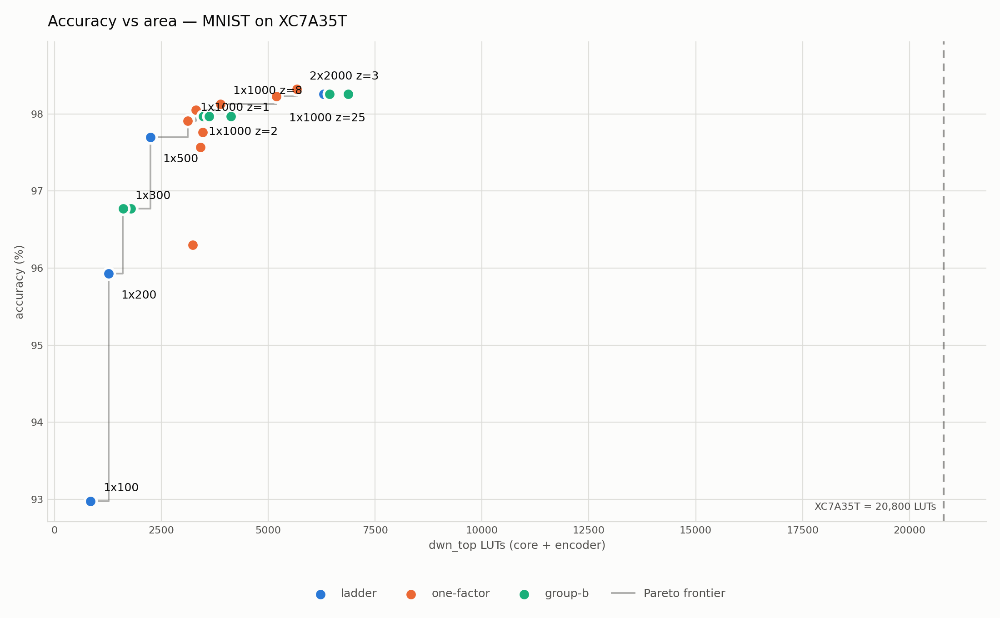
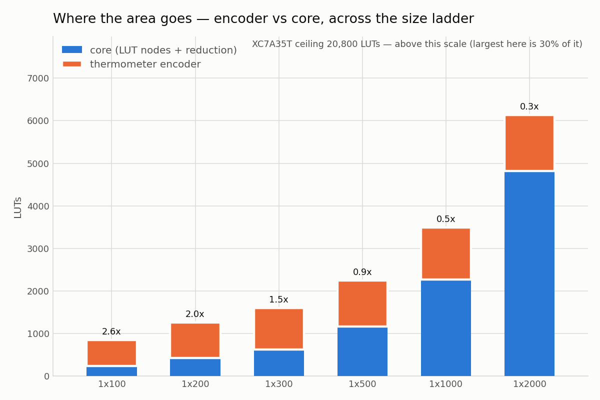
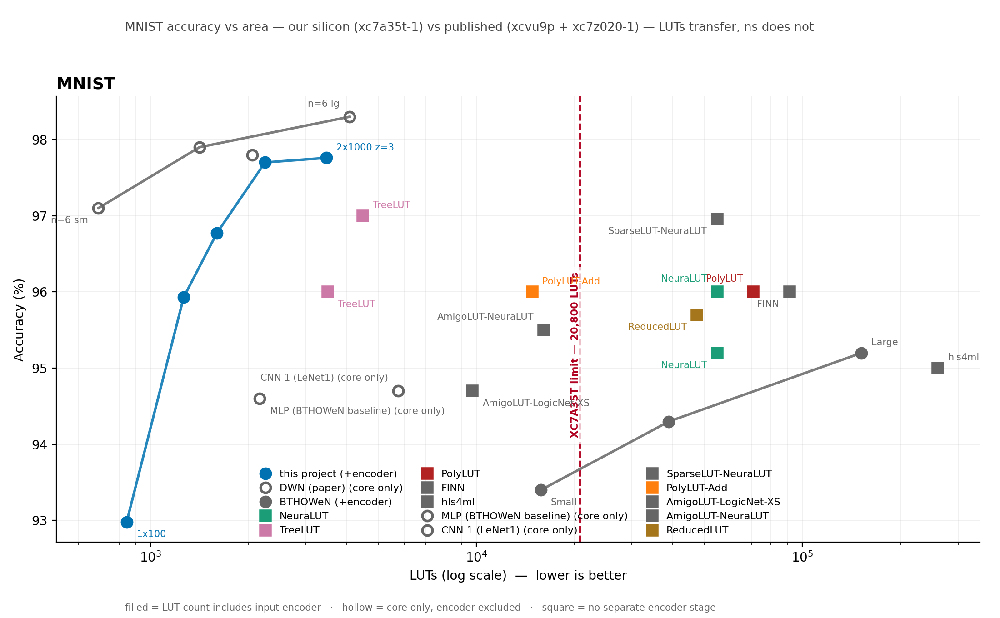

# The Same Generator, a Different Problem: A Weightless Neural Network on MNIST at 3,464 Lookup Tables

**Kanishk Sama · Krithik Sama**
The University of Texas at Austin

---

> **Version.** Every MNIST figure in this report was measured on the `mnist` branch after the
> descriptor refactor, and is reproduced by `docs/mnist/results/sweep-results.json` and
> `docs/mnist/results-cc/`. The companion JSC study is `docs/jsc/report.md`, whose figures are pinned to the
> `jsc-complete` tag; the two sets of numbers describe different commits and must not be mixed in
> one table. Where this report cites a JSC figure it uses the tagged value.

## Abstract

A Differentiable Weightless Neural Network replaces multiply-accumulate arithmetic with lookup
tables, which map directly onto the lookup tables an FPGA is physically built from. A companion
study showed this works for jet substructure classification — sixteen features, five classes — on a
Digilent Basys 3, a $150 board built around a Xilinx Artix-7 XC7A35T with 20,800 lookup tables.

This report asks a different question: **does the generator generalise, or did it learn one
dataset?** MNIST is a deliberately unfavourable second target — **forty-nine times the input
features** (784 against 16), twice the classes, and a natively 8-bit input where the first study's
was continuous. We port the flow, and the *port itself* is the result: the exporter, RTL generator
and testbenches become dataset-agnostic, with dataset facts confined to a descriptor.

We measure 25 configurations, all place-and-routed. The best design meeting the board's 100 MHz
clock reaches **97.76% at 3,464 lookup tables (16.65% of the device), five cycles of latency**, and
is verified bit-exact against its software model on all 10,000 test samples **on the physical
board**. Against BTHOWeN — a weightless network of the same lineage, on the closest comparable
silicon in the literature — it is **2.56 percentage points more accurate using 43.8× fewer lookup
tables**. Against a gradient-boosted ensemble built by us at the same area on the same part, it is
**13.45 points more accurate and 4.6× slower**. Our implementation reproduces the DWN paper's own
area–accuracy trade-off to within 9% at matched accounting convention.

Three findings generalise beyond MNIST. The **encoder-convention defect** identified in the first
study recurs, and is *width-dependent* here rather than a single factor — 72.3% of design area at
100 nodes, 20.9% at 2,000 — so no fixed multiplier can repair a mis-conventioned table. The
**dataset-ambiguity defect does not apply**, establishing that it was specific to the first
benchmark rather than endemic to the field. And a **measured 0.24 pp noise floor** turns out to
exceed most pairwise gaps in the published MNIST literature, including one that overturned our own
headline result.

---

## 1. Why a second dataset

The first study answered *can a DWN run on an entry-level FPGA*. It could not answer *is this a
tool or a one-off*, because every part of the flow had only ever seen one dataset. A pipeline that
works on exactly one input is indistinguishable from one that has been fitted to it.

MNIST was chosen because it is unfavourable in the ways that matter to the implementation:

| | JSC | MNIST |
|---|---|---|
| input features | 16 | **784** (49×) |
| classes | 5 | 10 |
| input word | Q3.12, continuous | **Q0.8**, natively 8-bit |
| board record | 33 bytes | **1,569 bytes** (48×) |

**The deliverable was the generalised flow, not the accuracy number.** A port that did not fit the
board would still have been a success if the generator came out general. It fit, which is a bonus
rather than the point.

## 2. What generalising actually required

The flow was not dataset-agnostic; it had been *written while looking at one dataset*. Seven
distinct sites hard-coded a fact about JSC, every one of which was silent rather than loud:

| site | wrong for MNIST because |
|---|---|
| RTL emitter: `16 * thermometer_bits` | 784 features, not 16 |
| record size: `word_bits // 8` | a 9-bit word is 2 bytes; floor division gives 1 |
| UART loader: `reg [5:0]` byte counter | caps at 63; the record is 1,568 bytes |
| testbenches: `[2:0]` class index | ten classes need four bits |
| board top: `correct_count[7:0]` | a part-select past the end is a synthesis *error* |
| exporter: `FRAC_BITS`/`WORD_BITS` | Q3.12 inherited as a default by six modules |
| host: `// 8` again, and a literal `33 bytes` | the same two defects, in the host |

They surfaced one crash at a time for a structural reason: a `datasets/` package holding the right
facts existed, and **nothing imported it**. A descriptor nothing reads is documentation, not a
boundary.

The fix that ended the sequence was to resolve the dataset from the checkpoint's own shape, and to
**delete the module-level constants entirely** so the widths became required arguments. That is
what makes it durable: a missing argument is an error at the call site, where a default is a
plausible wrong number that reaches the FPGA.

**The contract this establishes, and its test:** adding a third dataset should mean adding a
descriptor and a documentation directory, and editing nothing in the exporter, generator, RTL,
testbenches or scripts. Verified continuously — after every generalisation change the first study
had to reproduce *exactly*, and did.

## 3. Verification

Correctness is established at two levels, both required before any area number is quoted.

**Gate 1 — bit-exactness in simulation.** The generated RTL must match a numpy golden model derived
from the same checkpoint, on every test vector including deliberately adversarial ones. **25 of 25
configurations pass.** Random vectors matter as much as real ones: with ten classes and a hundred
nodes per class, ties in the output score are common rather than exotic, and both numpy and torch
break them toward the lowest index, so the hardware must too.

**Gate 1b — bit-exactness on silicon.** The whole test set is streamed to the board over UART and
scored on-chip. **10,000 of 10,000 samples agree.** The fixed-point and float32 models also agree
on all 10,000 — Q0.8 is exactly lossless here, for a structural reason given in §6.

Both gates were re-run after the descriptor refactor, on both datasets, because a refactor verified
only in simulation is a refactor verified only in simulation.

## 4. Design-space exploration

25 configurations, every one place-and-routed at `xc7a35tcpg236-1` with a 10 ns target.



The curve climbs almost vertically to about 2,250 lookup tables and then flattens hard. `1x500`
reaches 97.70% at 2,246; quadrupling to `1x2000` buys **+0.56 pp for 2.8× the area** — and does not
meet the board clock.

### 4.1 Only five configurations meet the 100 MHz board clock

| config | acc% | core | encoder | total | % device | Fmax | cycles |
|---|---|---|---|---|---|---|---|
| `2x[1000,500]` | **97.76** | 2,168 | 1,302 | 3,464 | 16.65 | 103.8 | 5 |
| `1x500` | 97.70 | 1,168 | 1,079 | 2,246 | 10.80 | 108.4 | 4 |
| `1x300` | 96.77 | 630 | 971 | 1,597 | 7.68 | 107.5 | 4 |
| `1x200` | 95.93 | 420 | 839 | 1,264 | 6.08 | 111.3 | 4 |
| `1x100` | 92.98 | 234 | 611 | 845 | 4.06 | 123.8 | 4 |

The two most accurate designs in the sweep — `2x[2000,1000]` at 98.32% and `1x2000` at 98.26% —
**miss the clock**, at 92.3 and 94.0 MHz. A table that lists them beside designs that run is
comparing things that are not comparable.

### 4.2 Depth buys timing, not accuracy

`2x[1000,500]` and `1x1000` are the same size (3,464 against 3,490 lookup tables) and statistically
the same accuracy (97.76 against 97.97 — inside the noise floor). But the two-layer model gets a
**fifth pipeline stage for free**, because a register is inserted per layer, and reaches **103.8 MHz
where the single-layer manages 93.1**.

At the board's real clock, the deeper model is usable and the flat one is not. This confirms on a
second dataset a mechanism the first study identified.

### 4.3 Reducing pipeline depth never helps

| `1x2000` | stages | core | total | Fmax |
|---|---|---|---|---|
| baseline | 4 | 4,821 | 6,294 | **94.0** |
| no output register | 3 | 4,815 | 6,433 | 82.6 |
| no popcount register | 3 | 5,560 | 6,871 | **53.2** |
| two-stage | 2 | 5,560 | 6,877 | 48.5 |

Removing the popcount register costs **41 MHz and 739 core lookup tables** — a 200-wide group sum
is a deep adder tree and that register is load-bearing. Four stages is both the architectural
maximum for a single-layer model and the optimum. The lever that *does* work is over-constraining:
asking the tools for 8 ns yields 97.4 MHz where asking for 10 ns yields 93.1.

### 4.4 The encoder saturates, and the area story inverts



Across a twenty-fold range of model size the encoder grows only **611 → 1,315** lookup tables, so
its share of the design falls from **72.3%** at `1x100` to **20.9%** at `1x2000`. MNIST is
*slot-limited*: 784 × z bits far exceed the input slots any layer that fits can read, so widening
the model buys new comparators only until the learned mapping saturates.

This is the reverse of the first study, where the encoder dominated at every width — and it is why
the two datasets' frontiers cannot share an axis.

### 4.5 Thermometer resolution is nearly free; fan-in is not a lever

| z | 1 | 2 | 3 | 8 | 25 |
|---|---|---|---|---|---|
| accuracy | 97.91 | 98.05 | 97.97 | 98.13 | 98.23 |
| encoder LUTs | 846 | 1,038 | 1,220 | 1,618 | 2,935 |

**0.32 pp across a 25× encoder** — barely above the noise floor. Twenty-five thresholds per pixel
cost 2,077 more lookup tables than one, two thirds of the whole design, for a third of a point.

Fan-in `n` is not an area lever here at all: `n=2` saves 7% of area for **−1.67 pp** and `n=4` saves
2% for −0.40 pp, because core area is dominated by node count and the encoder rather than by table
size. On the first dataset `n` mattered.

### 4.6 A measured noise floor of 0.24 pp, which overturned our own result

Four configurations trained under four seeds each. The spread is **0.24 pp**, and **the same seed
does not reproduce** — a rerun differed by up to 0.17 pp, almost certainly GPU non-determinism.

It withdrew three claims, including our headline: a two-layer taper that appeared to be the best
model in the study, at 98.32%, averages **98.19%** over four seeds against `1x2000`'s **98.29%**.
The advantage did not merely fail to clear the floor — **it reversed.** The 98.32% was one lucky
seed; re-running that exact seed gave 98.15%.

**No accuracy in this report is quoted to more than two decimals, and no two designs are ranked on
a gap below 0.24 pp.**

## 5. Comparison against published work



26 rows, 21 read directly from the primary paper's own table. Marker fill carries the accounting
convention, because that is the axis on which these numbers most easily mislead.

### 5.1 The encoder convention recurs, and is worse here

Published lookup-table counts are frequently **core-only**, excluding the input encoder; ours
include it. Read against the wrong convention, our `1x300` at 1,597 lookup tables against the DWN
paper's `sm` at 692 looks like a 2.3× failure. Like for like, on core only, `1x300` is **630** —
smaller than 692.

Because the encoder's share runs from 72.3% to 20.9% across our ladder, **the correction is
width-dependent**: no single multiplier repairs a mis-conventioned table. Every row must carry its
own convention, which is why our snapshot stores core and encoder separately.

### 5.2 Accuracy is often printed coarser than the noise floor

The two most-cited comparators print `96%`. That spans ±0.5 pp — **twice our measured floor**. And
an independent re-run puts the same named models at **95.20%** and **95.42%**, so those rows are an
*upper bound* and our margins over them are understated rather than overstated.

### 5.3 The dataset-ambiguity defect does not apply — which is itself a result

The first study's largest correction was that its benchmark is **two different datasets ~1.05 pp
apart**, conflated by the standard comparison table. **MNIST has one canonical split**, so the
entire class of correction is absent and every accuracy below is directly comparable.

Establishing the *scope* of a defect is a finding: the single-dataset study could not tell whether
this was endemic to the field or specific to that benchmark. It is specific.

### 5.4 Against the weightless family — the comparison this project was waiting for

BTHOWeN is the same lineage, on `xc7z020clg400-1` — **the same 7-series family and speed grade as
our part**, where the lookup-table-DNN literature sits on a Virtex UltraScale+ two process
generations ahead. It also prints three decimals, so §5.2 does not apply.

| | acc% | LUTs | cycles |
|---|---|---|---|
| BTHOWeN Small | 93.4 | 15,756 | 25 |
| BTHOWeN Medium | 94.3 | 38,912 | 37 |
| BTHOWeN Large | 95.2 | 151,704 | 74 |
| **this work `2x[1000,500]`** | **97.76** | **3,464** | **5** |
| **this work `1x300`** | **96.77** | **1,597** | **4** |

**+2.56 pp over BTHOWeN-Large at 43.8× fewer lookup tables.** `1x300` alone beats every BTHOWeN
model while using 9.9× fewer than the smallest. Both designs even share an input stage — BTHOWeN
uses thermometer encoding, and its bits-per-input is exactly our `z`.

**ULEEN, the other weightless comparator, is more accurate than we are: 98.46% against 97.76%.** It
cannot be placed in a lookup-table column — its results are ASIC area in mm² and model size in KiB,
with no FPGA figure for MNIST. Our answer against ULEEN is area and latency, not accuracy.

### 5.5 Against a gradient-boosted ensemble on identical silicon

Built by us, same part, same clock target, same flow, same convention, within 5.5% of the same
area:

| | acc% | LUTs | Fmax | cycles |
|---|---|---|---|---|
| **DWN `2x[1000,500]`** | **97.76** | 3,464 | 103.8 | 5 |
| conifer `gbdt_d3_n5` | 84.31 | 3,653 | **477.3** | **3** |

**13.45 points at matched area** — and **conifer is 4.6× faster.** That belongs in the headline, not
a footnote: a boosted ensemble's critical path is one comparator tree, ours is an encoder, then
lookup-table layers, then a popcount. If the requirement is throughput rather than accuracy per
lookup table, a gradient-boosted ensemble is the better answer.

### 5.6 Almost nothing published would fit this board

Of the published MNIST designs with an FPGA lookup-table count, **only BTHOWeN-Small (15,756) and
the DWN paper's own rows fall under the XC7A35T's 20,800.** NeuraLUT needs 2.6× the device, PolyLUT
3.4×, hls4ml 12.5×.

### 5.7 Our implementation reproduces the paper

| | ours | DWN paper | ratio | Δ acc |
|---|---|---|---|---|
| `1x300` vs `sm` | 96.77% / **630** | 97.1% / 692 | **0.91×** | −0.33 pp |
| `1x2000` vs `lg` | 98.26% / **4,821** | 98.3% / 4,082 | 1.18× | −0.04 pp |

**Stronger evidence of correctness than Gate 1 can give.** Gate 1 proves our RTL matches *our*
golden model; this shows the entire pipeline lands where the authors' independent implementation
lands. Corroborated independently: the same table reports the first study's `sm` at **110** lookup
tables, and we measured **110**.

## 6. Q0.8 is exactly lossless, for a structural reason

The first study found its 16-bit input word six bits wider than necessary, and narrowing it cost
accuracy that had to be measured. MNIST's word is nine bits — one sign, eight fractional — and
**loses nothing at all**: across the full test set, 56,835 feature values saturate at the word
boundary and **not one changes an encoder bit**.

The reason is structural rather than lucky. MNIST pixels are natively 8-bit, so there are only 256
distinct input values and nine bits cannot lose information. The first dataset's features are
continuous, so quantising them genuinely discards information and costs 30 samples in 166,000.

**Precision is not a property of the flow; it is a property of the data.** One consequence appeared
during the sweep: at 25 thresholds per pixel one quantile lands on exactly 1.0, which Q0.8's
[−1, 1) cannot represent, so that configuration alone requires a ten-bit word. The integer width is
derivable exactly from the checkpoint; the fractional width is not derivable at all, and must be
chosen and stated.

## 7. Limitations

- **The frontier has no measured edge.** The ladder stops at 2,000 nodes and 33% of the device by
  decision. *"The largest MNIST model that fits"* is unsupported; the supported statement is *"the
  largest tried was 33% of the device and it fit comfortably."*
- **The gradient-boosting comparison is two synthesized points**, not a curve. *"The largest
  ensemble built was 4,427 lookup tables at 85.90%"* — never *"its ceiling is X"*.
- **hls4ml was not measured on MNIST.** A scope cut citing the published row, not a finding.
- **Five of 26 literature rows are survey-sourced** rather than read from the primary paper, though
  the survey's checkable rows match their primaries exactly.
- **Cross-silicon comparison is unavoidable.** Lookup-table counts transfer between Xilinx families;
  **nanoseconds do not**. Latency is reported in cycles throughout.
- **Accuracy is bounded by our noise floor**, and several published rows are bounded by their own
  rounding. Gaps under 1 pp against a whole-percent row are not interpretable in either direction.
- **The area model is not usable on MNIST** and no projected area is quoted anywhere in this report.
  It under-predicts by 8–19% across the ladder and mis-predicts comparator counts by up to 108%.

## 8. Conclusion

The generator generalises. The same exporter, RTL generator and testbenches that produced a
five-class model from sixteen continuous features produce a ten-class model from 784 eight-bit
pixels, with dataset facts confined to a descriptor and every shared component verified to
reproduce the first study exactly.

On the second dataset it reaches **97.76% at 3,464 lookup tables and 103.8 MHz**, bit-exact on
silicon across all 10,000 test samples. Against its own weightless lineage on comparable silicon it
is **2.56 points more accurate at 43.8× smaller**. Against the authors' own implementation it lands
within 9% at matched convention. Against a gradient-boosted ensemble at identical area it is 13.45
points more accurate and 4.6× slower.

Of every published MNIST design in the comparison with a lookup-table count, only one other would
fit the board this one was verified on.

---

## Appendix A — Complete measurements

All 25 configurations, place-and-routed at `xc7a35tcpg236-1`, 10 ns target unless stated.
Machine-readable: `docs/mnist/results/sweep-results.json`.

| group | config | acc% | core | enc | total | %dev | Fmax | cyc |
|---|---|---|---|---|---|---|---|---|
| ladder | `1x100` | 92.98 | 234 | 611 | 845 | 4.06 | 123.8 | 4 |
| ladder | `1x200` | 95.93 | 420 | 839 | 1,264 | 6.08 | 111.3 | 4 |
| ladder | `1x300` | 96.77 | 630 | 971 | 1,597 | 7.68 | 107.5 | 4 |
| ladder | `1x500` | 97.70 | 1,168 | 1,079 | 2,246 | 10.80 | 108.4 | 4 |
| ladder | `1x1000` | 97.97 | 2,272 | 1,220 | 3,490 | 16.78 | 93.1 | 4 |
| ladder | `1x2000` | 98.26 | 4,821 | 1,315 | 6,294 | 30.26 | 94.0 | 4 |
| z | `1x1000 z=1` | 97.91 | 2,272 | 846 | 3,118 | 14.99 | 95.4 | 4 |
| z | `1x1000 z=2` | 98.05 | 2,272 | 1,038 | 3,310 | 15.91 | 90.6 | 4 |
| z | `1x1000 z=8` | 98.13 | 2,272 | 1,618 | 3,883 | 18.67 | 91.5 | 4 |
| z | `1x1000 z=25` | 98.23 | 2,272 | 2,935 | 5,195 | 24.98 | 92.8 | 4 |
| n | `1x1000 n=2` | 96.30 | 2,257 | 996 | 3,240 | 15.58 | 95.3 | 4 |
| n | `1x1000 n=4` | 97.57 | 2,272 | 1,147 | 3,414 | 16.41 | 92.5 | 4 |
| corner | `2x[1000,500]` | 97.76 | 2,168 | 1,302 | 3,464 | 16.65 | 103.8 | 5 |
| corner | `2x[2000,1000]` | 98.32 | 4,271 | 1,403 | 5,670 | 27.26 | 92.3 | 5 |

Plus eleven Group B variants (pipeline depth and clock target on already-trained models) in the
snapshot; §4.3 gives the `1x2000` set.

## Appendix B — Reproducing this

Assumes the first study's toolchain (`docs/jsc/report.md` Appendix C), plus `scikit-learn` and `pandas`.

```
# Gate 1 — bit-exactness in simulation, no board needed. No precision flags:
# Q0.8 comes from the dataset descriptor.
python scripts/run_gate1.py --checkpoint <ckpt> --rtl-dir build/mnist/rtl --work build/mnist/gate1

# Area and timing
python scripts/run_synth.py --impl --rtl-dir build/mnist/rtl

# The full test set, generated locally — no GPU required
python scripts/dump_testset.py <ckpt>

# Build, program, and verify on silicon.  --depth 16 is REQUIRED: the host defaults to the
# first study's 1024, and a 12,544-bit-wide store holds only 16 records.
python scripts/build_bitstream.py --checkpoint <ckpt> --rtl-dir build/mnist/rtl
python scripts/program.py --bit build/mnist/board/basys3/dwn_basys3_top.bit
python scripts/host.py --gate1b --depth 16 --checkpoint <ckpt>

# Confirm the first study still reproduces exactly — 22/22
python scripts/verify_phase1.py --with-board
```

## Appendix C — Sources

Phase logs, with the retractions and dead ends: `docs/mnist/phase1-ledger.md`,
`phase2-ledger.md`, `phase3-ledger.md`, `reduction-ledger.md`. Per-phase detail:
`phase1-report.md`, `phase2-report.md`, `phase3-report.md`. Literature table with per-row
provenance and confidence: `cc/literature/mnist_literature.json`.
